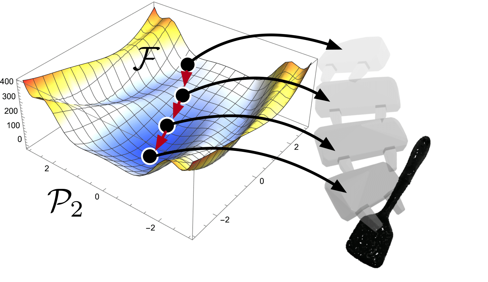

# GraspFlow

## Introduction
In this work, we present GraspFlow, a refinement approach for generating context-specific grasps. We formulate the problem of grasp synthesis as a sampling problem: we seek to sample from a context-conditioned probability distribution of successful grasps. However, this target distribution is unknown. As a solution, we devise a discriminator gradient-flow method to evolve grasps obtained from a simpler distribution in a manner that mimics sampling from the desired target distribution. Unlike existing approaches, GraspFlow is modular, allowing grasps that satisfy multiple criteria to be obtained simply by incorporating the relevant discriminators. It is also simple to implement, requiring minimal code given existing auto-differentiation libraries and suitable discriminators.Experiments show that GraspFlow generates stable and executable grasps on a real-world Panda robot for a diverse range of objects.
In particular, in 60 trials on 20 different household objects, the first attempted grasp was successful 94% of the time, and 100% grasp success was achieved by the second grasp. Moreover, incorporating a functional discriminator for robot-
human handover improved the functional aspect of the grasp by up to 33%.

<!--  -->

<!--  -->

## Grasp Generation

## Section 2: GraspNet from NVidia

We use Pytorch version [2] of the Graspnet [1]. 
### Prerequisits:However, due to the fact that we use Pytorch, GraspFlow
1. Pointnet2_PyTorch (given as a submodule in this repo) - PointNet++ library for GraspNet's backbone.
2. franka_analytical_ik [2] - solves analytical IK for Panda Robot.

### Installation
We mainly follow same installation as in [2]. However, we also extended it to add additional filtering capabilites. Please install IK submodule and copy generated library to pytorch_6dof-graspnet module. Details are given in [this link](https://github.com/tasbolat1/franka_analytical_ik.git).

## Reference List
[1]. Mousavian, Arsalan, Clemens Eppner, and Dieter Fox. "6-dof graspnet: Variational grasp generation for object manipulation." Proceedings of the IEEE/CVF International Conference on Computer Vision. 2019. [Original GitHub repo](https://github.com/NVlabs/6dof-graspnet.git)

[2]. Jens Lundell. "6-DOF GraspNet Pytorch". 2020. [Original GitHub repo](https://github.com/jsll/pytorch_6dof-graspnet.git)

[3]. He, Yanhao, and Steven Liu. "Analytical inverse kinematics for franka emika panda–a geometrical solver for 7-dof manipulators with unconventional design." 2021 9th International Conference on Control, Mechatronics and Automation (ICCMA). IEEE, 2021. [Original GitHub repo](https://github.com/ffall007/franka_analytical_ik.git)